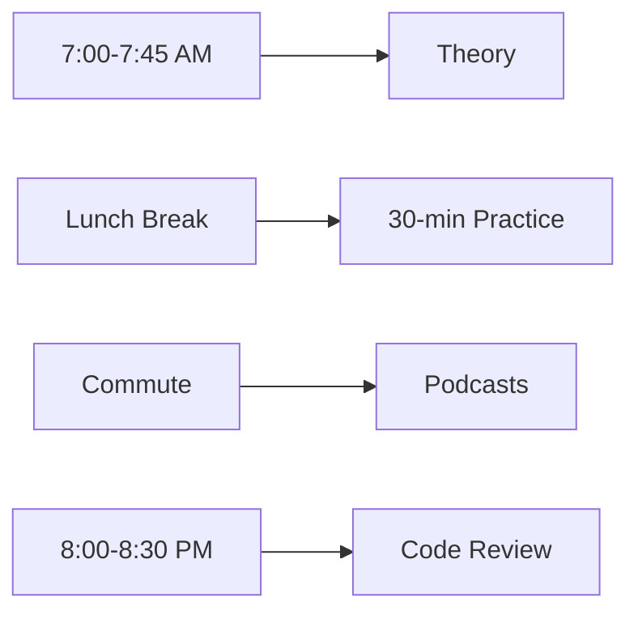

# Web Development Learning Roadmap (MDN Core Curriculum)

> 16-week flexible plan for full-time professionals | [Original MDN Curriculum](https://developer.mozilla.org/en-US/curriculum/core/)

## 🚦 Key Principles
- **Daily Commitment**: 45-90 minutes (adjustable)
- **Flex Structure**: Swap days based on workload
- **Project-First**: Learn by building
- **Office Integration**: Micro-learning during breaks/commute
- **Burnout Protection**: Mandatory rest days

---

## 📅 Complete 16-Week Daily Roadmap

### **Week 1: Web Foundations**
| Day | Topic | MDN Resource | Practice Task |
|-----|-------|--------------|---------------|
| Mon | How the Web Works | [Link](https://developer.mozilla.org/en-US/docs/Learn/Getting_started_with_the_web/How_the_Web_works) | Diagram HTTP request flow |
| Tue | HTML Basics | [Link](https://developer.mozilla.org/en-US/docs/Learn/HTML/Introduction_to_HTML/Getting_started) | Create semantic page skeleton |
| Wed | Links & Images | [Link](https://developer.mozilla.org/en-US/docs/Learn/HTML/Multimedia_and_embedding) | Build image gallery |
| Thu | HTML Forms | [Link](https://developer.mozilla.org/en-US/docs/Learn/Forms) | Design contact form |
| Fri | Accessibility Fundamentals | [Link](https://developer.mozilla.org/en-US/docs/Learn/Accessibility/What_is_accessibility) | Audit existing page |

### **Week 2: CSS Core**
| Day | Topic | MDN Resource | Practice Task |
|-----|-------|--------------|---------------|
| Mon | CSS Selectors | [Link](https://developer.mozilla.org/en-US/docs/Learn/CSS/Building_blocks/Selectors) | Style Week 1's page |
| Tue | Box Model | [Link](https://developer.mozilla.org/en-US/docs/Learn/CSS/Building_blocks/The_box_model) | Create card components |
| Wed | Flexbox | [Link](https://developer.mozilla.org/en-US/docs/Learn/CSS/CSS_layout/Flexbox) | Build responsive nav bar |
| Thu | CSS Grid | [Link](https://developer.mozilla.org/en-US/docs/Learn/CSS/CSS_layout/Grids) | Design magazine layout |
| Fri | Responsive Design | [Link](https://developer.mozilla.org/en-US/docs/Learn/CSS/CSS_layout/Responsive_Design) | Make portfolio mobile-friendly |

### **Week 3: Advanced CSS**
| Day | Topic | MDN Resource | Practice Task |
|-----|-------|--------------|---------------|
| Mon | CSS Variables | [Link](https://developer.mozilla.org/en-US/docs/Web/CSS/Using_CSS_custom_properties) | Implement theme switcher |
| Tue | Transitions | [Link](https://developer.mozilla.org/en-US/docs/Web/CSS/CSS_Transitions/Using_CSS_transitions) | Animate buttons |
| Wed | Media Queries | [Link](https://developer.mozilla.org/en-US/docs/Web/CSS/Media_Queries/Using_media_queries) | Add tablet breakpoints |
| Thu | Accessibility Testing | [Link](https://developer.mozilla.org/en-US/docs/Learn/Tools_and_testing/Cross_browser_testing/Accessibility) | Fix contrast issues |
| Fri | CSS Architecture | [Link](https://developer.mozilla.org/en-US/docs/Learn/CSS/Building_blocks/Organizing) | Refactor portfolio CSS |

### **Week 4: JavaScript Fundamentals**
| Day | Topic | MDN Resource | Practice Task |
|-----|-------|--------------|---------------|
| Mon | JS Syntax | [Link](https://developer.mozilla.org/en-US/docs/Learn/JavaScript/First_steps) | Console calculator |
| Tue | Variables & Types | [Link](https://developer.mozilla.org/en-US/docs/Learn/JavaScript/First_steps/Variables) | Data type converter |
| Wed | Functions | [Link](https://developer.mozilla.org/en-US/docs/Learn/JavaScript/Building_blocks/Functions) | Password validator |
| Thu | Arrays | [Link](https://developer.mozilla.org/en-US/docs/Learn/JavaScript/First_steps/Arrays) | Shopping cart manager |
| Fri | Objects | [Link](https://developer.mozilla.org/en-US/docs/Learn/JavaScript/Objects) | User profile system |

### **Week 5: DOM Manipulation**
| Day | Topic | MDN Resource | Practice Task |
|-----|-------|--------------|---------------|
| Mon | DOM Introduction | [Link](https://developer.mozilla.org/en-US/docs/Web/API/Document_Object_Model/Introduction) | Explore DOM tree |
| Tue | Selecting Elements | [Link](https://developer.mozilla.org/en-US/docs/Web/API/Document/querySelector) | Dynamic content loader |
| Wed | Events | [Link](https://developer.mozilla.org/en-US/docs/Learn/JavaScript/Building_blocks/Events) | Interactive buttons |
| Thu | Dynamic Content | [Link](https://developer.mozilla.org/en-US/docs/Learn/JavaScript/Client-side_web_APIs/Manipulating_documents) | Live character counter |
| Fri | Mini-Project | - | Image carousel |

### **Week 6: APIs & Async JS**
| Day | Topic | MDN Resource | Practice Task |
|-----|-------|--------------|---------------|
| Mon | JSON | [Link](https://developer.mozilla.org/en-US/docs/Learn/JavaScript/Objects/JSON) | JSON data parser |
| Tue | Fetch API | [Link](https://developer.mozilla.org/en-US/docs/Web/API/Fetch_API/Using_Fetch) | Fetch user data |
| Wed | Async/Await | [Link](https://developer.mozilla.org/en-US/docs/Learn/JavaScript/Asynchronous/Async_await) | Sequential API calls |
| Thu | Error Handling | [Link](https://developer.mozilla.org/en-US/docs/Learn/JavaScript/Building_blocks/Handling_errors) | Graceful API failure |
| Fri | Mini-Project | - | Crypto price tracker |

### **Week 7: Modern JavaScript**
| Day | Topic | MDN Resource | Practice Task |
|-----|-------|--------------|---------------|
| Mon | ES6 Modules | [Link](https://developer.mozilla.org/en-US/docs/Web/JavaScript/Guide/Modules) | Modularize weather app |
| Tue | Destructuring | [Link](https://developer.mozilla.org/en-US/docs/Web/JavaScript/Reference/Operators/Destructuring_assignment) | Clean API response handling |
| Wed | Template Literals | [Link](https://developer.mozilla.org/en-US/docs/Web/JavaScript/Reference/Template_literals) | Dynamic HTML generator |
| Thu | Local Storage | [Link](https://developer.mozilla.org/en-US/docs/Web/API/Window/localStorage) | Persistent settings |
| Fri | Mini-Project | - | Theme switcher with memory |

### **Week 8: Developer Workflow**
| Day | Topic | Resource | Practice Task |
|-----|-------|----------|---------------|
| Mon | Chrome DevTools | [Link](https://developer.mozilla.org/en-US/docs/Learn/Common_questions/Tools_and_setup/What_are_browser_developer_tools) | Debug CSS layout |
| Tue | Command Line | [Link](https://developer.mozilla.org/en-US/docs/Learn/Tools_and_testing/Understanding_client-side_tools/Command_line) | File operations |
| Wed | Git Fundamentals | [Link](https://developer.mozilla.org/en-US/docs/Learn/Tools_and_testing/GitHub) | Initialize repo |
| Thu | GitHub Workflow | [Link](https://guides.github.com/introduction/flow/) | First PR |
| Fri | Deployment | [Link](https://developer.mozilla.org/en-US/docs/Learn/Tools_and_testing/Understanding_client-side_tools/Deployment) | Deploy to GitHub Pages |

### **Week 9: Testing & Tooling**
| Day | Topic | Resource | Practice Task |
|-----|-------|----------|---------------|
| Mon | Unit Testing (Jest) | [Link](https://jestjs.io/docs/getting-started) | Test calculator functions |
| Tue | Linting (ESLint) | [Link](https://eslint.org/) | Configure rules |
| Wed | Bundling (Webpack) | [Link](https://webpack.js.org/guides/getting-started/) | Bundle JS modules |
| Thu | CI/CD Concepts | [Link](https://developer.mozilla.org/en-US/docs/Learn/Tools_and_testing/Understanding_client-side_tools/Deployment) | GitHub Actions setup |
| Fri | Performance Audit | [Link](https://developer.mozilla.org/en-US/docs/Learn/Performance) | Lighthouse report |

### **Week 10: Backend Basics (Node.js)**
| Day | Topic | Resource | Practice Task |
|-----|-------|----------|---------------|
| Mon | Node.js Fundamentals | [Link](https://nodejs.dev/en/learn/) | Simple HTTP server |
| Tue | NPM Ecosystem | [Link](https://developer.mozilla.org/en-US/docs/Learn/Tools_and_testing/Understanding_client-side_tools/Package_management) | Install/use packages |
| Wed | Express Framework | [Link](https://expressjs.com/) | Basic routing |
| Thu | REST API Concepts | [Link](https://developer.mozilla.org/en-US/docs/Glossary/REST) | Design API endpoints |
| Fri | CRUD Operations | - | Book manager API |

### **Week 11: Databases**
| Day | Topic | Resource | Practice Task |
|-----|-------|----------|---------------|
| Mon | SQL Fundamentals | [Link](https://developer.mozilla.org/en-US/docs/Glossary/SQL) | Design book schema |
| Tue | SQLite Integration | [Link](https://www.sqlite.org/index.html) | Connect DB to API |
| Wed | MongoDB Basics | [Link](https://www.mongodb.com/basics) | NoSQL document setup |
| Thu | ORM/ODM Concepts | [Link](https://developer.mozilla.org/en-US/docs/Learn/Server-side/Express_Nodejs/mongoose) | Mongoose models |
| Fri | Database Relationships | - | Author-Book relationship |

### **Week 12: Authentication**
| Day | Topic | Resource | Practice Task |
|-----|-------|----------|---------------|
| Mon | Auth Concepts | [Link](https://developer.mozilla.org/en-US/docs/Web/HTTP/Authentication) | Compare methods |
| Tue | JWT Authentication | [Link](https://jwt.io/introduction) | Token generation |
| Wed | Sessions & Cookies | [Link](https://developer.mozilla.org/en-US/docs/Web/HTTP/Cookies) | Persistent login |
| Thu | OAuth Overview | [Link](https://developer.mozilla.org/en-US/docs/Web/HTTP/Authentication#oauth) | "Login with GitHub" |
| Fri | Security Best Practices | [Link](https://cheatsheetseries.owasp.org/cheatsheets/Authentication_Cheat_Sheet.html) | Implement rate limiting |

### **Week 13: Full-Stack Integration**
| Day | Topic | Practice Task |
|-----|-------|---------------|
| Mon | API-Frontend Connection | Connect React to Express |
| Tue | State Management | JWT in local storage |
| Wed | Deployment Strategies | Dockerize application |
| Thu | CORS Configuration | [MDN Guide](https://developer.mozilla.org/en-US/docs/Web/HTTP/CORS) | Fix cross-origin errors |
| Fri | Error Handling | Unified error responses |

### **Week 14: Advanced Concepts**
| Day | Topic | Resource | Practice Task |
|-----|-------|----------|---------------|
| Mon | WebSockets | [Link](https://developer.mozilla.org/en-US/docs/Web/API/WebSockets_API) | Real-time chat |
| Tue | GraphQL Basics | [Link](https://graphql.org/learn/) | Alternative to REST |
| Wed | TypeScript Intro | [Link](https://www.typescriptlang.org/docs/) | Add types to API |
| Thu | Serverless Concepts | [Link](https://developer.mozilla.org/en-US/docs/Web/JavaScript/Guide/Modules) | AWS Lambda demo |
| Fri | WebAssembly | [Link](https://developer.mozilla.org/en-US/docs/WebAssembly) | Run C++ in browser |

### **Week 15: Optimization**
| Day | Topic | Resource | Practice Task |
|-----|-------|----------|---------------|
| Mon | Performance Budgets | [Link](https://web.dev/performance-budgets-101/) | Audit application |
| Tue | Caching Strategies | [Link](https://developer.mozilla.org/en-US/docs/Web/HTTP/Caching) | Implement ETags |
| Wed | Lazy Loading | [Link](https://web.dev/lazy-loading/) | Image optimization |
| Thu | PWA Fundamentals | [Link](https://developer.mozilla.org/en-US/docs/Web/Progressive_web_apps) | Add manifest.json |
| Fri | SEO Best Practices | [Link](https://developer.mozilla.org/en-US/docs/Glossary/SEO) | Structured data |

### **Week 16: Capstone Project**
| Day | Task |
|-----|------|
| Mon | Plan project architecture |
| Tue | Implement core features |
| Wed | Write tests |
| Thu | Optimize performance |
| Fri | Deploy & document |

---

## ⚙️ Flexibility System
### Office-Friendly Schedule



### 1. Workload-Based Adjustments Table
| Work Intensity | Daily Target | Weekend Action |
|----------------|-------------|---------------|
| High Pressure  | 30-min MDN reading | Rest |
| Normal Load    | 60-min coding | Project work |
| Light Week     | 90-min deep dive | Hackathon |

### 2. Burnout Prevention
```markdown
- Every Sunday = NO CODE DAY
- Monthly "Fun Week" (build games, not apps)
- 80/20 Rule: Focus on core 20% that delivers 80% results
```


## 🔧 3. Essential Resources
1. **All-in-One Kit**: [MDN Learning Pathway](https://developer.mozilla.org/en-US/docs/Learn)
2. **Practice Platforms**: 
   - [Frontend Mentor](https://www.frontendmentor.io/)
   - [Codewars](https://www.codewars.com/)
3. **Office Tools**:
   - [GitPod](https://www.gitpod.io/) (cloud IDE)
   - [LeetCode Mobile](https://leetcode.com/) (algorithms on phone)
